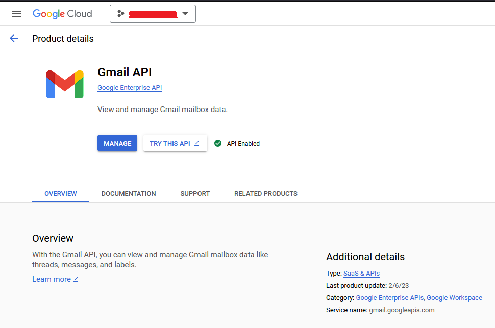
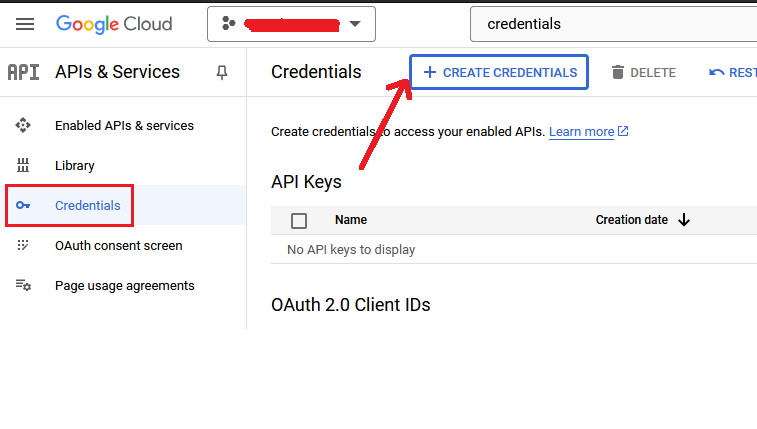
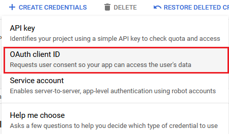
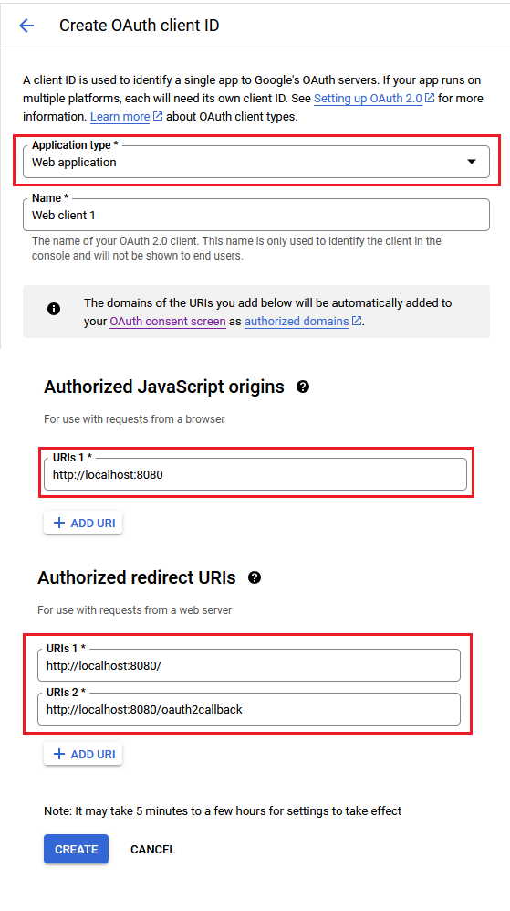
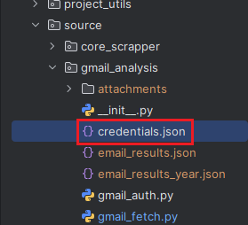
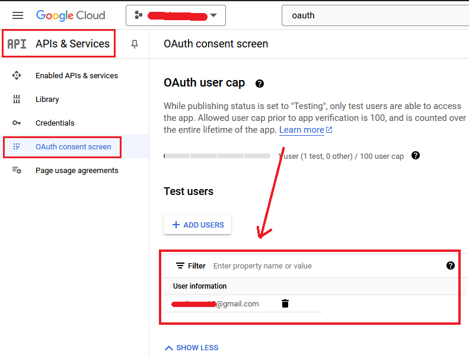

# LinkedIn Application Tracker

LinkedIn Application Tracker is a Python project that helps you monitor your LinkedIn job applications by analyzing your Gmail inbox. It authenticates with Gmail, fetches relevant emails, and processes data to provide insights about your job applications over time.

## Features

- **Gmail Authentication**: Securely authenticate with your Gmail account using OAuth 2.0.
- **Email Fetching**: Retrieve emails from your Gmail inbox with support for pagination and filtering.
- **Data Extraction**: Extract email details including subjects, senders, recipients, dates, bodies, and attachments.
- **Attachment Handling**: Download and store email attachments locally.
- **Application Tracking**: Analyze your Gmail data to track LinkedIn job applications over time.
- **Data Visualization**: Visualize application counts over time using Matplotlib.

## Getting Started

### Prerequisites

- Python 3.6 or higher
- A Google account with Gmail access
- Gmail API credentials (client ID and client secret)

### Installation

1. Clone the repository:
   ```bash
   git clone https://github.com/yourusername/linkedin-application-tracker.git
   ```
2. Navigate to the project directory:
   ```bash
    cd linkedin-application-tracker
    ```
3. Install dependencies:
    ```bash
    pip install -r requirements.txt
    ```

### Setting Up Gmail API Credentials
1. Go to the Google Cloud Console.
2. Create a new project or select an existing one.
3. Enable the Gmail API for your project.

4. Create OAuth 2.0 credentials:

- Go to APIs & Services > Credentials.
- Click Create Credentials and select OAuth client ID.


- Choose Desktop app as the application type.

- Download the credentials.json file and place it in the gmail directory




5. Setup yourself as tester of your OAuth 2.0 App


### Running the script
1. Authenticate with Gmail
Run the authentication script to authenticate your Google account:
```bash
python gmail_auth.py
```
This will open a browser window for you to log in to your Google account and grant permissions. The script will save your credentials in a token.pickle file for future use

2. Fetch emails
Fetch emails from your Gmail inbox
```bash
python gmail_fetch.py
```

This script will:

- Fetch emails from your inbox.
- Extract details such as subject, sender, recipient, date, body, and attachments.
- Save email data to email_results.json.
- Download attachments to the attachments directory.

3. Track LinkedIn applications
Analyze the fetched email data to track your LinkedIn job applications:
```bash
python track_linkedin_applications.py
```

This script will:

- Load the email_results.json file.
- Count the number of LinkedIn application emails over time.
- Aggregate counts by day, week, month, quarter, or year.
- Plot the application counts over time using Matplotlib.

### Customization
- Modify `gmail_fetch.py` to adjust the email fetching criteria (e.g., labels, query parameters).
- Customize the data visualization in `track_linkedin_applications.py` as per your needs.

## Project Structure

```gmail_auth.py```: Handles Gmail authentication using OAuth 2.0

```gmail_fetch.py```: Fetches emails from Gmail and extracts data

```track_linkedin_applications.py```: Analyzes email data to track LinkedIn applications

## Dependencies
The project requires the following Python packages:

- `google-auth-oauthlib`: Google OAuth 2.0 client library
- `google-api-python-client`: Google API client library
- `matplotlib`: Data visualization library

Install them using
```bash
pip install -r requirements.txt
```

## Security Considerations
- **Credential safety**: Keep your `credentials.json` and `token.pickle` files secure. Do not share them or commit them to a public repository.
- **Scopes**: The scripts use the `https://www.googleapis.com/auth/gmail.readonly` scope, which grants read-only access to your Gmail account. Be cautious if modifying the scopes.

## License
This project is licensed under the MIT License. See the LICENSE file for more details.

## Author
Developed by [Mateus](https://mateusb12.github.io/mateus_portfolio/). Contributions and feedback are welcome!