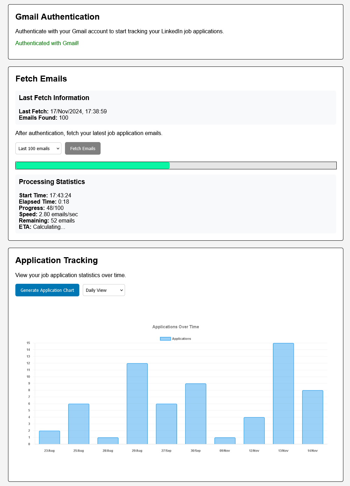

# 📊 LinkedIn Application Tracker

LinkedIn Application Tracker is a web application that helps you monitor your LinkedIn job applications through two main approaches:
1. 📧 Analyzing your Gmail inbox for LinkedIn application emails
2. 🌐 Scraping your LinkedIn saved jobs page

## 🌟 Features



### 🔍 Gmail Integration
- 🔒 **Secure Authentication**: OAuth 2.0 integration with Gmail API
- 📩 **Email Analysis**: Fetches and analyzes LinkedIn application emails
- ⏱️ **Real-time Progress**: Live progress tracking with speed, ETA, and completion statistics
- 📊 **Data Visualization**: Interactive charts showing application trends over time
- 🗓️ **Multiple Views**: Analyze data by day, week, month, quarter, or year
- 🧮 **Metadata Tracking**: Keeps track of last fetch time and email counts

### 🔍 Email Fetching Details
The **Gmail Integration** feature utilizes the Gmail API to securely fetch and analyze your LinkedIn job application emails. To perform this functionality, the application requests the following permissions from Google:

- 🔑 **https://www.googleapis.com/auth/gmail.readonly**: This scope allows the application to read your Gmail messages and settings without modifying them.

**🤔 Why This Permission?**
- 🛡️**Security**: By requesting only read-only access, the application ensures that your emails remain unaltered, maintaining your data's integrity and privacy.
- 🧩 **Minimal Access Principle**: Adhering to Google's best practices, the application requests the minimal necessary permissions required to perform its functions. This approach facilitates a smoother app review process and enhances user trust.
- ✅ **Impact on App Review**: Since the application requests only read-only access to Gmail, it reduces the complexity of the app review process. However, it's essential to clearly explain the necessity of this permission in your app's privacy policy and during the review to avoid any compliance issues.

**🕵️‍♂️ How Emails Are Fetched:**
1. 🔓 **Authentication**: Users authenticate their Gmail account through OAuth 2.0, granting the application permission to access their emails.
2. 🔍 **Fetching Emails**: The application uses the Gmail API to search for and retrieve emails from `jobs-noreply@linkedin.com`.
3. 🛠️ **Processing Emails**: Retrieved emails are analyzed to extract relevant information such as job titles, companies, and application dates.
4. 💾 **Data Storage**: Processed data is stored locally in the `data` directory for visualization and tracking purposes.

**👁️‍🗨️ Data Privacy Considerations:**
- 🗄️ **Local Storage**: All fetched email data is stored locally, ensuring that sensitive information is not transmitted or stored on external servers.
- 🔒 **Credential Safety**: The `credentials.json` file and OAuth tokens are stored securely in the `source/secrets` and `tokens` directories, respectively.
- 🔏 **Limited Scope**: By using only read-only access, the application minimizes the risk associated with handling user data.

### 🔍 LinkedIn Scraping (In Development)
- 🤖 **Automated Browser**: Selenium-based scraping of LinkedIn saved jobs
- 🍪 **Cookie Management**: Persistent login through cookie storage
- 📄 **Data Extraction**: Collects job titles, companies, and application dates

## ✨ Getting Started

### 📋 Prerequisites
- Node.js and npm for the web application
- Python 3.6+ for the scraping functionality
- Google Cloud Console account for Gmail API access
- Chrome browser for LinkedIn scraping

### 💾 Installation

1. Clone the repository:
   ```bash
   git clone https://github.com/yourusername/linkedin-application-tracker.git
   ```
2. Install Node.js dependencies:
   ```bash
   npm install
   ```
3. Install Python dependencies:
   ```bash
   pip install -r requirements.txt
   ```

### 🔧 Setting Up Gmail API Credentials

1. Go to the Google Cloud Console.
2. Create a new project or select an existing one.
3. Enable the Gmail API for your project.
   
4. Create OAuth 2.0 credentials:
   - Go to APIs & Services > Credentials.
   - Click Create Credentials and select OAuth client ID.
     
     
   - Choose WebApplication/Desktop as the application type, and set up the callback URI
     
   - Download the `credentials.json` file and place it in the `source/secrets` directory

### 🗂️ Project Structure

```
├── public/
│   └── images/          # Static images including favicon
├── source/
│   ├── core_scrapper/   # LinkedIn scraping functionality
│   ├── path/            # Path management utilities
│   ├── scripts/         # Utility scripts
│   ├── services/        # Core services
│   │   ├── gmailAuthService.js
│   │   ├── gmailFetchService.js
│   │   ├── applicationTrackingService.js
│   │   └── fetchMetadataService.js
│   └── views/          # EJS templates
├── data/               # Storage for email results and metadata
└── tokens/             # OAuth tokens storage
```

### ▶️ Running the Application

1. Start the web server:
   ```bash
   node source/app.js
   ```

2. Navigate to [http://localhost:8080](http://localhost:8080) in your browser

3. Click "Authenticate with Gmail" to connect your Google account

4. Use the interface to:
   - Fetch emails from Gmail
   - Track fetch progress in real-time
   - Generate visualization charts
   - Switch between different time-based views (daily, weekly, monthly, etc.)

## 🔒 Security Considerations
- 🔑 **Credential Safety**: Keep your `credentials.json` and tokens secure
- 🗄️ **Local Storage**: Email data is stored locally in the `data` directory
- 🔏 **Limited Scope**: Uses read-only Gmail access for minimal permissions

## 📜 License
This project is licensed under the MIT License. See the LICENSE file for details.

## 👤 Author
Developed by [Mateus](https://mateusb12.github.io/mateus_portfolio/). Contributions and feedback are welcome!